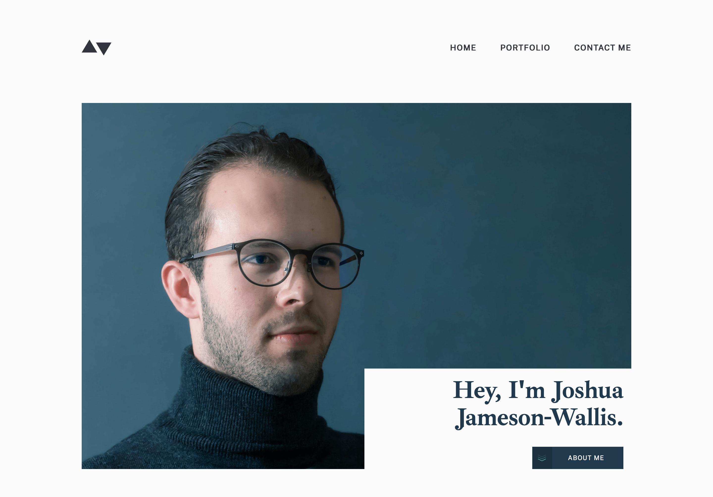

# Joshua Jameson-Wallis - Personal Portfolio

This is a solution to the [Minimalist portfolio website coding challenge](https://www.frontendmentor.io/challenges/minimalist-portfolio-website-LMy-ZRyiE) on Frontend Mentor

## Table of contents

-  [Overview](#overview)
   -  [Screenshot](#screenshot)
   -  [Links](#links)
-  [My process](#my-process)
   -  [Built with](#built-with)
   -  [What I learned](#what-i-learned)
   -  [Continued development](#continued-development)
   -  [Useful resources](#useful-resources)
-  [Author](#author)

## Overview

### The challenge

Your users should be able to:

-  View the optimal layout for each page depending on their device's screen size
-  See hover states for all interactive elements throughout the site
-  Click the "About Me" call-to-action on the homepage and have the screen scroll down to the next section
-  Receive an error message when the contact form is submitted if:
-  The `Name`, `Email Address` or `Message` fields are empty should show "This field is required"
-  The `Email Address` is not formatted correctly should show "Please use a valid email address"

### Screenshot



### Links

-  Live Site URL: http://www.joshuajamesonwallis.com/

## My process

### Built with

-  Semantic HTML5 markup
-  Mobile-first workflow
-  Flexbox
-  CSS Grid
-  Sass
-  TypeScript

### What I learned

```html
<div class="cta__body__line"></div>
```

The fluid line between both the 'contact me' button and call to action title provided a nice challenge, since I had to keep the line within the DOM via an empty `div`. This is something that we usually want to avoid doing, however not in this case since applying a pseudo element to a grid container forces it to become either the first or last grid item and never in-between.

```scss
.details {
   grid-template-columns: repeat(5, 1fr);
   grid-template-rows: repeat(4, auto);
}
```

I was able to further develop my CSS Grid skills by creating a larger number of rows and columns on the individual project pages, in order to have more control over the alignment and widths of content in accordance with the original design.

```scss
@include mqs(min-width, tablet-home, max-width, desktop) {
   grid-template-columns: 320px auto;
   grid-template-rows: minmax(630px, auto);
   @include e(img) {
      background-position: 71% 100%;
   }
}
```

Since I used this project as a template for my own portfolio, I had to create the project images myself and use my own profile images too. I learnt the importance of matching their dimensions with the original assets provided to avoid mis-alignment with other content, as well as creating similar effects within CSS such as rotating my profile image so I was facing the same direction.

```html
<form
   action="https://formspree.io/f/mayvnvee"
   method="post"
   id="submit-form"
   class="form"
   novalidate
>
   ...
</form>
```

Finally, this was my first time connecting a form with a 3rd party service that would handle its submission and email me any data provided. I chose Formspree because of its simplicity to integrate into existing projects, where you only need to provide a specifc endpoint within the form's action for their API to then handle all the rest.

### Continued development

I look forward to integrating more 3rd party services that make our lives easier when dealing with forms, such as JS validation libraries. Based on the research I've already conducted, I can see how they simplify the process since they automatically create error messages for you, allow us to set custom styling options and remove the need to copy powerful regular expressions around from project to the next.

### Useful resources

-  [Formspree](https://formspree.io/) - An incredibly useful service for dealing with form submissions and sending you the data, whilst performing their own validation to protect you against spam.

## Author

-  Website - [Joshua Jameson-Wallis](https://www.joshuajamesonwallis.com/)
-  Linkedin - [Joshua Jameson-Wallis](https://www.linkedin.com/in/joshua-jameson-wallis/)

#####TODO

`Manual testing` - playing around with App yourself to see if works | larger projects - new features/changes could affect other components | not feasible to check all components on each new addition - automated catches this immediately…

    `Automated testing` - test scripts we write saying this component should work a certain way | triggers an action + expects an outcome | run these on each implementation to catch errors | serves as `documentation` if written well

    `Terms` - `High value` features (main app purpose) | `edge cases` within these (`error msgs`), things that can `easily break` (that maybe popup during development)

    `Test Driven Development` - `methodology` for each feature | write tests to check `before` implementing feature (will fail at first because the feature isn’t there yet) | write `bare-minimum` amount of code needed for tests to pass, run tests again (should `pass`)

`3 A’s pattern` - `Arrange` (arranging the state of data + app - declaring vars within test()), `act` (when act on whatever testing - fireEvent) + `assert` (assert it worked correctly - expect())

    `Basic component testing` - most important first (often used), within - `user interactions` (fireEvents), `conditional rendering` (state changes), `utils/hooks` - custom hooks or functions used throughout app | avoid `unnecessary` tests - useState() value changes post mutation (not reliable + doesn’t reflect how users will use your app) |  `Testing library package:` – simple utilities for testing DOM-based user interfaces

    `Unit tests` - `local` tests written by yourself (single functionality + small parts of code - a function) | forces you to think deeply about the possible `outcomes` of functions (+ potential edge cases) | provides warnings if try to delete `edge cases` which other code relies on (+ has been tested) + `prevents` you from deleting it

    `Integration` tests - `multiple units` in app working correctly together (combining units into 1 larger test) | tests Interactions between units - most will interact with each other during `runtime`

    `End-end` test - `front-end to back-end` | longer execution time | tests user interactions in a `real-life browser + real DOM (vs virtual) + real data/API` (vs hard-coded mockup test strings) by providing it `instructions` for what to do (click/type) and expected outcomes | cares about how `users` see + interact with app | `Cypress` - `E2E testing library` | had to install `multiple` libraries before - can now just use one | setup, writing, running + recording tests easier + faster - testing and development can happen `simultaneously` | executes commands in `real-time` as write them | ex: waiting for dynamic content to load, mobile responsive views, control the responses from network requests - solve edge cases where server down/no result returned | `screenshots` taken during test - can time travel back to each state from when first ran | `cy.visit(‘http://localhost:3000’)` - navigate to a specific URL where our application lies, `cy.get(‘#greeting-nav-button’)’click()` - grabs nav btn + clicks, then ex below occurs:

```
cy.get('#greetings-input').type('Evgeny', { delay: 400 })
cy.get('#greetings-show-button').click()
cy.get('#greeting-text').should('include.text', 'Hello Evgeny!')
```

    `Visual regression testing` - takes a `screenshot` of pages/components + compares them with screenshots that were captured in `previous successful` tests | any discrepancies found - `notification` provided | some of these libraries work well with Cypress - adding onto test above visual test to make sure that change didn’t affect UI | `cy.percySnapshot()` - `Percy` (VRT library)

    `Performance testing` - speed of app (`SEO`) | `performance budget` - runs a test to calculate `size` + if failed test will prevent a `deployment` from happening if the size exceeds a certain `threshold` | what it measures - `load time, size of initial bundle, speed of specific functions` (ex)

    `Accessibility testing` - Google Lighthouse | axe-core (browser extension)
